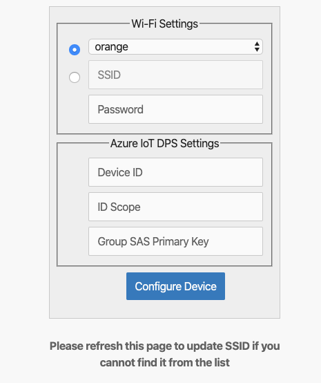

# MXChip PnP Asset Tracker

A variation on https://docs.microsoft.com/en-us/samples/azure-samples/mxchip-iot-devkit-pnp/sample that adds an interface for reporting (fake) location data.

The location is reported over a PnP interface (`urn:contoso:position:1`) whose detailed definition can be queried from the server as it is exposed thanks to the `urn:azureiot:ModelDiscovery:ModelDefinition` interface.

Simulated location telemetry consists of ~320 different points tracing a route from Seattle, WA to Redmond, WA.

## Prerequisites

To complete the steps in this article, you need the following resources:

1. A [DevKit device](https://aka.ms/iot-devkit-purchase).
2. An Azure IoT DPS instance with at least one Azure IoT Hub associated to it.

## Get device connection details

TODO

## Prepare the device

1. Download the latest [pre-built MXChip PnP Asset Tracker firmware](https://github.com/kartben/mxchip_pnp_asset_tracker/raw/master/bin/mxchip_pnp_asset_tracker.bin) for the DevKit device from GitHub.

1. Connect the DevKit device to your development machine using a USB cable. In Windows, a file explorer window opens on a drive mapped to the storage on the DevKit device. For example, the drive might be called **AZ3166 (D:)**.

1. Drag the **mxchip_pnp_asset_tracker.bin** file onto the drive window. When the copying is complete, the device reboots with the new firmware.

    > [NOTE]
    > If you see errors on the screen such as **No Wi-Fi**, this is because the DevKit has not yet been connected to WiFi.

1. On the DevKit, hold down **button B**, push and release the **Reset** button, and then release **button B**. The device is now in access point mode. To confirm, the screen displays "IoT DevKit - AP" and the configuration portal IP address.

1. On your computer or tablet, connect to the WiFi network name shown on the screen of the device. The WiFi network starts with **AZ-** followed by the MAC address. When you connect to this network, you don't have internet access. This state is expected, and you only connect to this network for a short time while you configure the device.

1. Open your web browser and navigate to [http://192.168.0.1/](http://192.168.0.1/). The following web page displays:
    

    On the web page, enter:

    - The name of your WiFi network (SSID).
    - Your WiFi network password.
    - The connection details: the **Device ID** that you can choose yourself, and the **Scope ID** and **Group SAS Primary Key** you made a note of previously.

    > [NOTE]
    > Currently, the IoT DevKit only can connect to 2.4 GHz Wi-Fi, 5 GHz is not supported due to hardware restrictions.

2. Choose **Configure Device**, the DevKit device reboots and runs the application:

    

    The DevKit screen displays a confirmation that the application is running:

    

The DevKit first registers a new device in the IoT Hub associated to your Device Provisioning Service, and then starts sending data.

## View the telemetry

TODO explain with VS Code and Azure IoT Explorer